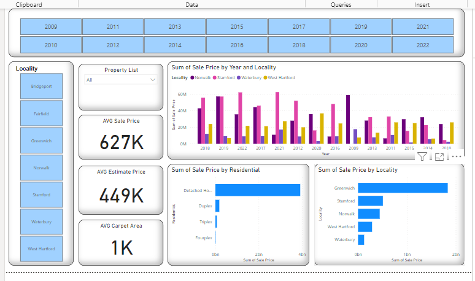

# Real Estate Project

This repository contains the code and resources for a Real Estate project where data visualization and prediction were performed using Python, data integration was done using SSIS (SQL Server Integration Services), and visualization was conducted using PowerBI.

## Project Overview

In this project, we aimed to analyze real estate data to derive insights and make predictions. We utilized various tools and technologies for different stages of the project:

- **Data Visualization and Prediction**:
  - Python was used for data analysis, visualization, and predictive modeling.
  - Libraries such as Pandas, Matplotlib, Seaborn, and Scikit-learn were employed for data manipulation, visualization, and machine learning tasks.
  
- **Data Integration**:
  - SSIS (SQL Server Integration Services) was utilized for data integration tasks, such as extracting data from various sources, transforming it, and loading it into a data warehouse or destination.
  
- **Visualization**:
  - PowerBI was chosen for its powerful visualization capabilities, allowing for the creation of interactive and insightful dashboards and reports.

## Screenshots

Here are some screenshots of the PowerBI visualizations:

## Usage

To use this project:

1. Clone the repository.
2. Set up the necessary environment for Python and SSIS as per the requirements specified in the project.
3. Run the Python scripts for data analysis, visualization, and prediction.
4. Utilize SSIS packages for data integration tasks.
5. Import the provided PowerBI files to visualize the data and insights.

## Dependencies

- Python 3.12
- Libraries: Pandas, Matplotlib, Seaborn, Scikit-learn
- SQL Server Integration Services (SSIS)
- PowerBI

## License

This project is licensed under the [MIT License](LICENSE).

## Acknowledgements

- Any acknowledgements or credits for libraries, datasets, or resources used in the project can be mentioned here.

